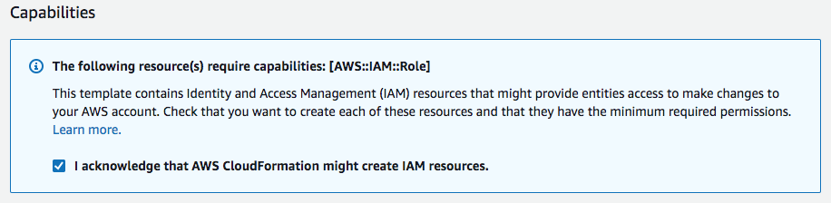
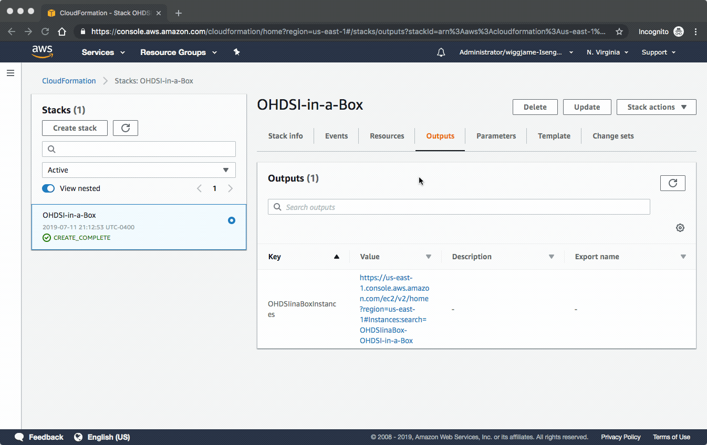

## OHDSI-in-a-Box

Quickly deploy a single instance implementation of OHDSI tools and sample data for personal learning and training enviroments.  If you are looking to deploy a enterprise, scalable OHDSI architecture then check out the [OHDSIonAWS project](https://github.com/OHDSI/OHDSIonAWS).  A Linux and Windows version of this environment are offered.  Both versions have the same set of OHDSI tools.  The Windows version uses 'pgAdmin 4' to allow access to the Postgres database while the Linux version uses 'SQL Workbench'.  The Linux version is ~40% less expensive to run, depending on the exact AWS instance type you choose.  You can also easily add multiple users to a single instance of the Linux version if you like.

## Deployment Walk Through Video
[](https://www.youtube.com/watch?v=9JbgyE4rW2w "OHDSI-in-a-Box Deployment Walk Through")


## Linux Version
| AWS Region Code | Name | Launch |
| --- | --- | --- 
| cn-northwest-1 | China (Ningxia)| [](https://cn-northwest-1.console.amazonaws.cn/cloudformation/home?region=cn-northwest-1#/stacks/new?stackName=OHDSI&templateURL=https://s3.amazonaws.com/ohdsi-rstudio/ohdsi-in-a-box-linux-china.yaml) |
| eu-west-1 | EU (Ireland)| [](https://console.aws.amazon.com/cloudformation/home?region=eu-west-1#/stacks/new?stackName=OHDSI&templateURL=https://s3.amazonaws.com/ohdsi-rstudio/ohdsi-in-a-box-linux.yaml) |
| ap-northeast-1 | AP (Tokyo)| [](https://console.aws.amazon.com/cloudformation/home?region=ap-northeast-1#/stacks/new?stackName=OHDSI&templateURL=https://s3.amazonaws.com/ohdsi-rstudio/ohdsi-in-a-box-linux.yaml) |
| us-east-1 | US East (N. Virginia)| [](https://console.aws.amazon.com/cloudformation/home?region=us-east-1#/stacks/new?stackName=OHDSI&templateURL=https://s3.amazonaws.com/ohdsi-rstudio/ohdsi-in-a-box-linux.yaml) |

| OHDSI Component | Version |
| --- | --- 
| OMOP Common Data Model | v5.3.1 |
| Atlas | v2.7.6 |
| WebAPI | v2.7.6 | 
| Usagi | v1.2.8 |
| WhiteRabbit | v0.9.0 |
| RabbitInAHat| v0.9.0 |
| Achilles | v1.6.3 |
| PatientLevelPrediction | v3.0.6 |
| DatabaseConnector | v2.4.1 |
| DatabaseConnectorJars | v1.0.0 |
| SqlRender | v1.6.2 |
| OhdsiRTools | v1.7.0 |
| FeatureExtraction | v2.2.2 |
| Cyclops | v2.0.2 |
| OhdsiSharing | v0.1.3 |

| Sample Data Source | Size |
| --- | --- 
| CMS DeSynPUF | 100k persons |
| CMS DeSynPUF | 1k persons |
| Synthea | 1k persons |

**RDP username:** ohdsi  
**RDP password:** this is specified as a parameter during deployment  
**Postgres username:** ohdsi  
**Postgres password:** this is specified as a parameter during deployment  

If you want to add users to the OHDSI-in-a-Box Linux version, you can do this by using the ```adduser``` command and then copying the ```ohdsi``` user home directory, as shown in the screenshot below:


## Windows Version
| AWS Region Code | Name | Launch |
| --- | --- | --- 
| cn-northwest-1 | China (Ningxia)| [](https://cn-northwest-1.console.amazonaws.cn/cloudformation/home?region=cn-northwest-1#/stacks/new?stackName=OHDSI&templateURL=https://s3.amazonaws.com/ohdsi-rstudio/ohdsi-in-a-box-china.yaml) |
| ap-northeast-1 | AP (Tokyo)| [](https://console.aws.amazon.com/cloudformation/home?region=ap-northeast-1#/stacks/new?stackName=OHDSI&templateURL=https://s3.amazonaws.com/ohdsi-rstudio/ohdsi-in-a-box.yaml) |
| eu-west-1 | EU (Ireland)| [](https://console.aws.amazon.com/cloudformation/home?region=eu-west-1#/stacks/new?stackName=OHDSI&templateURL=https://s3.amazonaws.com/ohdsi-rstudio/ohdsi-in-a-box.yaml) |
| us-east-1 | US East (N. Virginia)| [](https://console.aws.amazon.com/cloudformation/home?region=us-east-1#/stacks/new?stackName=OHDSI&templateURL=https://s3.amazonaws.com/ohdsi-rstudio/ohdsi-in-a-box.yaml) |


| OHDSI Component | Version |
| --- | --- 
| OMOP Common Data Model | v5.3.1 |
| Atlas | v2.7.0 |
| WebAPI | v2.7.0 | 
| Usagi | v1.1.6 |
| WhiteRabbit | v0.7.8 |
| RabbitInAHat| v0.7.8 |
| Achilles | v1.6.5 |
| PatientLevelPrediction | v3.0.5 |
| DatabaseConnector | v2.3.0 |
| DatabaseConnectorJars | v1.0.0 |
| SqlRender | v1.6.0 |
| OhdsiRTools | v1.7.0 |
| FeatureExtraction | v2.2.2 |
| Cyclops | v2.0.2 |
| OhdsiSharing | v0.1.3 |

| Sample Data Source | Size |
| --- | --- 
| CMS DeSynPUF | 100k persons |
| Synthea | 1k persons |

**RDP username:** ohdsi  
**RDP password:** this is specified as a parameter during deployment  
**Postgres username:** postgres  
**Postgres password:** ohdsi  


## OHDSI-in-a-Box Architecture
OHDSI-in-a-Box is specifically created as a learning environment, and is used in most of the tutorials provided by the OHDSI community. It includes many OHDSI tools, sample data sets, RStudio and other supporting software in a single, low cost Windows virtual machine. A PostgreSQL database is used to store the CDM and also to store the intermediary results from ATLAS. The OMOP CDM data mapping and ETL tools are also included in OHDSI-in-a-Box. A high-level diagram showing how the different components of OHDSI map to AWS Services is shown below.  


## OHDSI-in-a-Box deployment instructions

0. Install an RDP client to access you OHDSI-in-a-Box instance   
**Windows** includes an RDP client by default. To verify, in the search box on the taskbar, type Remote Desktop Connection, and then select Remote Desktop Connection. If your computer doesn't show this application, see the [Windows home page and search](https://windows.microsoft.com/) for the download for the Microsoft Remote Desktop app.  
**Mac OS X** Download the Microsoft Remote Desktop app from the Mac App Store.  
**Linux** Use [rdesktop](http://www.rdesktop.org/).

1. Begin the deployment process by clicking the **Launch Stack** button at the top of this page the corresponds to the version (Windows or Linux) and the AWS Region you want to us.  This will take you to the [CloudFormation Manage Console](https://console.aws.amazon.com/cloudformation/).  You will see the CloudFormation template URL is pre-populated. Click **Next**. 

2. The next screen will take in all of the parameters for your OHDSI environment.  A description is provided for each parameter to help explain its function, but following is also a detailed description of how to use each parameter.  At the top of this screen, be sure to provide a unique **Stack Name**.   

#### Security
|Parameter Name| Description|
|---------------|-----------|
| Instance Password | **Required** This password will be used to allow you to login to the OHDSI-in-a-Box instance.  It can contain upper and lowercase letters, numbers, and/or these special characters !@# |
| Limit access to IP address range? | **Required** This parameter allows you to limit the IP address range that can access your Atlas and RStudio servers. It uses CIDR notation. The default of 0.0.0.0/0 will allow access from any address.|

#### Scaling
|Parameter Name| Description|
|---------------|-----------|
| Number of OHDSI-in-a-Box instances to deploy | This determines the number of OHDSI-in-a-Box instances that will be deployed.  This allows you to easily deploy more than 1 instance if you are using it for a virtual training environment. |
| Instance type to use for each OHDSI-in-a-Box instance | This determines the processing power of your OHDSI-in-aBox instance.  Typically, t3.medium offers a good balance between cost and performance  For more information, see the [list of available EC2 instnance types](https://aws.amazon.com/ec2/instance-types/). |
| Disk space for each OHDSI-in-a-Box instance | This defines the disk size of the OHDSI-in-a-Box instance in GBs.  The minimum size is 100GB and the maximum size is 16,000GB (or 16TB).  You can use this parameter to deploy additional disk space in order to upload your own data into your OHDSI-in-a-Box instance. |

#### Networking
|Parameter Name| Description|
|---------------|-----------|
| Subnet | This is the subnet within an AWS VPC into which all of your instances will be deployed.  If you aren't familiar with this setting, you can choose a subnet from within your Default VPC.  They typically have a name like **subnet-111111a (172.31.0.0/20)** |
| VPC | This is the AWS VPC into which all of your instances will be deployed.  It must be the VPC that contains the subnet you specified above.  If you aren't familiar with this setting, you can choose your Default VPC.  It will typically have a name like **vpc-111111a (172.31.0.0/16)** |

When you've provided appropriate values for the **Parameters**, choose **Next**.

3. On the next screen, you can provide some other optional information like tags at your discretion, or just choose **Next**.

4. On the next screen, you can review what will be deployed.  Be sure to check the box that says **I acknowledge that AWS CloudFormation might create IAM resources.** as shown in the image below.  Then choose **Create**.



5. You can watch as CloudFormation builds out your OHDSI environment. A CloudFormation deployment is called a *stack*. The parent stack creates several child stacks depending on the parameters you provided.  When all the stacks have reached the green CREATE_COMPLETE status, as shown in the screenshot following, then the OHDSI architecture has been deployed.  Select the **Outputs** tab to find a link to your OHDSI-in-a-Box instances, as shown below.


6.  You will now see a list of all of your OHDSI-in-a-Box instances and you can connect to them using your Remote Desktop client, the username **ohdsi** and the password you provided as a parameter.  It will take about 5 minutes after this list appears for each OHDSI-in-a-Box instance to boot up and for the password to be set.  If you connect to your instance and it says the password is incorrect, just wait a few more minutes for the password automation to complete.

7.  Once you are finished with your OHDSI-in-a-Box instances, just return to the AWS CloudFormation console and **Delete** the stack, as shown below.  This will terminate all of the instances you launched.



If you prefer to create your own customer OHDSI-in-a-Box image, take a look at the steps used to build this one.  They are documented in a file called OHDSI-In-a-box-QuickStart-Installation-Guide-v1.02 in this repository.

## Adding multiple users in Linux
If you'd like to add another user to your OHDSI-in-a-Box Linux instance, just login as the default 'ohdsi' user, open the Terminal icon on the desktop, and run the below commands replacing 'user2' with the username you'd like to use.  You can use this command over and over again to add new users.

```
sudo adduser user2
sudo cp -a . ../user2
sudo chown -R user2:user2 ../user2/.
```

## License

This library is licensed under the Apache 2.0 License. 
